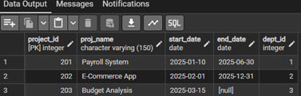
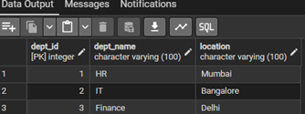
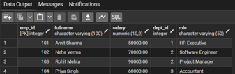
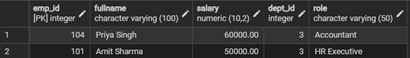
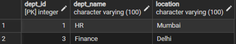
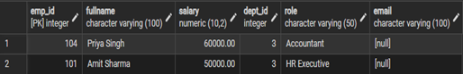

# Experiment 01.1 – DDL, DML and DCL Operations in SQL

---

## Student Information

- **Name:** Pratham  
- **UID:** 25MCI10178 
- **Branch:** MCA (Artificial Intelligence & Machine Learning)  
- **Section:** MAM-1 A  
- **Semester:** Second Semester  
- **Subject:** Technical Skills  
- **Date of Performance:** 12/01/2026  

---

## Experiment Title

**Design and Implementation of a Sample Database System using DDL, DML, and DCL Commands**

---

## Aim

To design and implement a sample database system using Data Definition Language (DDL), Data Manipulation Language (DML), and Data Control Language (DCL) commands, including database creation, data manipulation, schema modification, and role-based access control to ensure data integrity and secure, read-only access for authorized users.

---

## Software Requirements

- Oracle Database Express Edition  
- PostgreSQL  
- pgAdmin  

---

## Objectives

- To gain practical experience with DDL, DML, and DCL commands  
- To design relational tables with constraints  
- To implement secure role-based access control  
- To understand schema modification techniques  
- To maintain referential integrity in databases  

---

# Database Design

The database is designed to manage **Departments, Employees, and Projects** within an organization.

### Tables:
- Departments  
- Employees  
- Projects  

### Constraints Used:
- PRIMARY KEY  
- FOREIGN KEY  
- NOT NULL  
- UNIQUE  
- CHECK  

---

# Step 1: Table Creation (DDL)

### Departments Table

```sql
CREATE TABLE Departments (
    dept_id INT PRIMARY KEY,
    dept_name VARCHAR(100) NOT NULL UNIQUE,
    location VARCHAR(100) NOT NULL
);
```

---

### Employees Table

```sql
CREATE TABLE Employees (
    emp_id INT PRIMARY KEY,
    fullname VARCHAR(100) NOT NULL,
    salary DECIMAL(10,2) NOT NULL,
    dept_id INT NOT NULL
        REFERENCES Departments(dept_id)
        ON DELETE RESTRICT
        ON UPDATE CASCADE,
    role VARCHAR(50) NOT NULL
);
```

---

### Projects Table

```sql
CREATE TABLE Projects (
    project_id INT PRIMARY KEY,
    proj_name VARCHAR(150) NOT NULL,
    start_date DATE NOT NULL,
    end_date DATE,
    dept_id INT NOT NULL
        REFERENCES Departments(dept_id)
        ON DELETE RESTRICT
        ON UPDATE CASCADE
);
```

---

## Output

```

```

---

# Step 2: Data Manipulation (DML)

### Insert Records

#### Departments

```sql
INSERT INTO Departments VALUES
(1, 'HR', 'Mumbai'),
(2, 'IT', 'Bangalore'),
(3, 'Finance', 'Delhi');
```

---

#### Employees

```sql
INSERT INTO Employees VALUES
(101, 'Amit Sharma', 50000, 1, 'HR Executive'),
(102, 'Neha Verma', 70000, 2, 'Software Engineer'),
(103, 'Rohit Mehta', 90000, 2, 'Project Manager'),
(104, 'Priya Singh', 60000, 3, 'Accountant');
```

---

#### Projects

```sql
INSERT INTO Projects VALUES
(201, 'Payroll System', '2025-01-10', '2025-06-30', 1),
(202, 'E-Commerce App', '2025-02-01', '2025-12-31', 2),
(203, 'Budget Analysis', '2025-03-15', NULL, 3);
```

---





```
```

---

# Step 3: UPDATE Operations

### Change an employee’s department

```sql
UPDATE Employees
SET dept_id = 3
WHERE emp_id = 101;
```


---

### Extend a project deadline

```sql
UPDATE Projects
SET end_date = '2026-03-31'
WHERE project_id = 202;
```

---

---

# Step 4: DELETE Operations

```sql
DELETE FROM Employees
WHERE dept_id = 2;

DELETE FROM Projects
WHERE dept_id = 2;

DELETE FROM Departments
WHERE dept_id = 2;
```

---

## Output

```

```




---

# Step 5: Access Control & Security (DCL)

### Create Role

```sql
CREATE ROLE reporting_user LOGIN PASSWORD 'report123';
```

---

### Grant SELECT Privileges

```sql
GRANT SELECT ON Departments TO reporting_user;
GRANT SELECT ON Employees TO reporting_user;
GRANT SELECT ON Projects TO reporting_user;
```

---

### Revoke CREATE Privilege

```sql
REVOKE CREATE ON SCHEMA public FROM reporting_user;
```

---

### Enforce Read-Only Access

```sql
REVOKE INSERT, UPDATE, DELETE ON ALL TABLES IN SCHEMA public FROM reporting_user;
```

---


```

```

---

# Step 6: Schema Modification

### Add Column

```sql
ALTER TABLE Employees
ADD COLUMN email VARCHAR(100);
```

---

### Drop Table

```sql
DROP TABLE Projects;
```

---

## Output

```

```

---

# Learning Outcomes

- Understood the basics of relational database design using tables, keys, and relationships.  
- Learned to apply primary and foreign key constraints to maintain data integrity.  
- Gained hands-on experience with INSERT, UPDATE, and DELETE operations.  
- Understood role-based access control using GRANT and REVOKE.  
- Learned how to create read-only users for secure data access.  
- Practiced ALTER TABLE and DROP TABLE commands for schema management.  

---

## Conclusion

This experiment provided practical exposure to core SQL concepts including DDL, DML, and DCL commands. It strengthened understanding of database security, referential integrity, and schema management, which are essential for real-world enterprise database systems.

---
