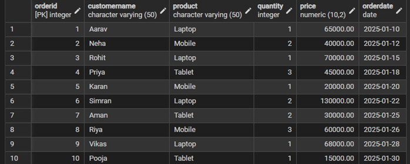
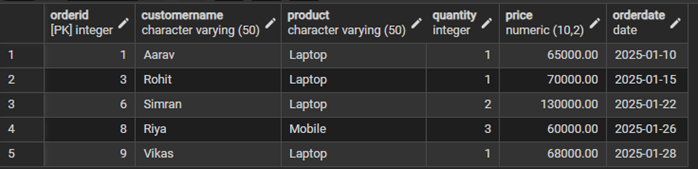
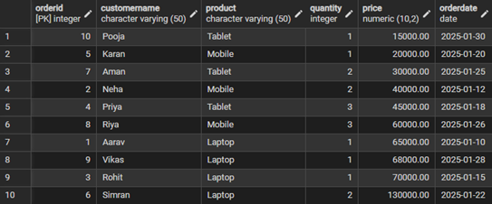
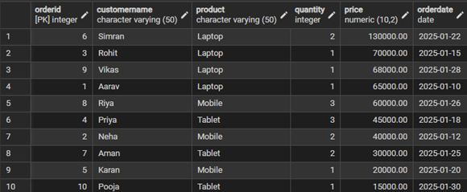
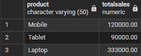
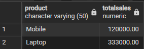
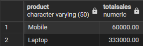
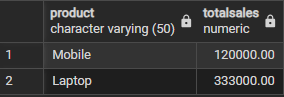

# Experiment 02 – SQL Filtering, Grouping and Sorting

## Student Information
- Name: Pratham  
- UID: 25MCI10178  
- Branch: MCA (AI & ML)  
- Section: MAM-1 A  
- Semester: Second Semester  
- Subject: Technical Skills  
- Date of Performance: 12/01/2026  

---

## Aim
To design and implement a sample database system using SQL commands to perform filtering, sorting, grouping, and aggregation operations and to understand the difference between row-level and group-level filtering.

---

## Software Requirements
- PostgreSQL  
- pgAdmin  
- Oracle Database Express Edition (optional)

---

## Objectives
- Retrieve specific data using filtering conditions  
- Sort query results using single and multiple attributes  
- Perform aggregation using grouping techniques  
- Apply conditions on aggregated data  
- Understand real-world analytical SQL queries  

---

## Step 1: Table Creation

```sql
CREATE TABLE CustomerOrders (
    OrderID SERIAL PRIMARY KEY,
    CustomerName VARCHAR(50),
    Product VARCHAR(50),
    Quantity INT,
    Price DECIMAL(10,2),
    OrderDate DATE
);
```

---

## Step 1.1: Insert Sample Data

```sql
INSERT INTO CustomerOrders 
(CustomerName, Product, Quantity, Price, OrderDate)
VALUES
('Aarav', 'Laptop', 1, 65000, '2025-01-10'),
('Neha', 'Mobile', 2, 40000, '2025-01-12'),
('Rohit', 'Laptop', 1, 70000, '2025-01-15'),
('Priya', 'Tablet', 3, 45000, '2025-01-18'),
('Karan', 'Mobile', 1, 20000, '2025-01-20'),
('Simran', 'Laptop', 2, 130000, '2025-01-22'),
('Aman', 'Tablet', 2, 30000, '2025-01-25'),
('Riya', 'Mobile', 3, 60000, '2025-01-26'),
('Vikas', 'Laptop', 1, 68000, '2025-01-28'),
('Pooja', 'Tablet', 1, 15000, '2025-01-30');
```

### Output:

## Step 2: Filtering Data

### Without CASE
```sql
SELECT *
FROM CustomerOrders
WHERE Price > 50000;
```

### With CASE
```sql
SELECT *
FROM CustomerOrders
WHERE 
    CASE 
        WHEN Price > 50000 THEN 1
        ELSE 0
    END = 1;
```

### Output:


---

## Step 3: Sorting Data

```sql
SELECT * FROM CustomerOrders ORDER BY Price ASC;
SELECT * FROM CustomerOrders ORDER BY Price DESC;
SELECT * FROM CustomerOrders ORDER BY Product ASC, Price DESC;
```

### Output:




---

## Step 4: Grouping and Aggregation

```sql
SELECT Product, SUM(Price) AS TotalSales
FROM CustomerOrders
GROUP BY Product;
```

```sql
SELECT Product, AVG(Price) AS AveragePrice
FROM CustomerOrders
GROUP BY Product;
```

### Output:



---

## Step 5: Row-Level vs Group-Level Filtering

### Group-Level (HAVING)
```sql
SELECT Product, SUM(Price) AS TotalSales
FROM CustomerOrders
GROUP BY Product
HAVING SUM(Price) > 100000;
```

### Row-Level (WHERE)
```sql
SELECT Product, SUM(Price) AS TotalSales
FROM CustomerOrders
WHERE Price > 50000
GROUP BY Product;
```

### Output:



---

## Step 6: Incorrect vs Correct Aggregation

### Incorrect
```sql
SELECT Product, SUM(Price)
FROM CustomerOrders
WHERE SUM(Price) > 100000
GROUP BY Product;
```

### Correct
```sql
SELECT Product, SUM(Price) AS TotalSales
FROM CustomerOrders
GROUP BY Product
HAVING SUM(Price) > 100000;
```



## Learning Outcomes
- Ability to create relational database tables
- Understanding of row-level filtering using WHERE
- Understanding of group-level filtering using HAVING
- Practical usage of CASE statements
- Application of aggregate functions
- Clear understanding of SQL execution order

---

## Conclusion
This experiment enhanced understanding of SQL analytical queries including filtering, sorting, grouping, and aggregation, which are essential for real-world database applications and interviews.
