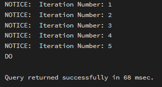
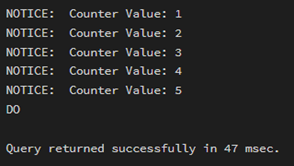
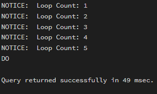
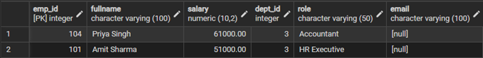
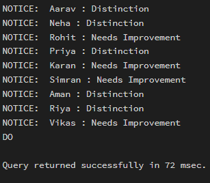

# Experiment 04 – Iterative Control Structures in PostgreSQL

## Experiment Title
Implementation of Iterative Control Structures using FOR, WHILE, and LOOP in PostgreSQL

---

## Aim
To understand and implement iterative control structures in PostgreSQL conceptually, including FOR loops, WHILE loops, and LOOP constructs, for repeated execution of database logic.

---

## Tools Used
- PostgreSQL
- pgAdmin

---

## Objectives
- To understand why iteration is required in database programming  
- To learn the purpose and behavior of FOR, WHILE, and LOOP constructs  
- To understand how repeated data processing is handled in databases  
- To relate loop concepts to real-world batch processing scenarios  
- To strengthen conceptual knowledge of procedural SQL used in enterprise systems  

---

## Example 1: FOR Loop – Simple Iteration

```sql
DO $$
BEGIN
    FOR i IN 1..5 LOOP
        RAISE NOTICE 'Iteration Number: %', i;
    END LOOP;
END $$;
```

### Output


---

## Example 2: FOR Loop with Query (Row-by-Row Processing)

```sql
DO $$
DECLARE
    rec RECORD;
BEGIN
    FOR rec IN SELECT entity_name, violation_count FROM Violations LOOP
        RAISE NOTICE 'Entity: %, Violations: %', rec.entity_name, rec.violation_count;
    END LOOP;
END $$;
```

### Output


---

## Example 3: WHILE Loop – Conditional Iteration

```sql
DO $$
DECLARE
    counter INT := 1;
BEGIN
    WHILE counter <= 5 LOOP
        RAISE NOTICE 'Counter Value: %', counter;
        counter := counter + 1;
    END LOOP;
END $$;
```

### Output


---

## Example 4: LOOP with EXIT WHEN

```sql
DO $$
DECLARE
    counter INT := 1;
BEGIN
    LOOP
        RAISE NOTICE 'Loop Count: %', counter;
        counter := counter + 1;
        EXIT WHEN counter > 5;
    END LOOP;
END $$;
```

### Output


---

## Example 5: Salary Increment Using FOR Loop

```sql
DO $$
DECLARE
    rec RECORD;
BEGIN
    FOR rec IN SELECT emp_id, salary FROM Employees LOOP
        UPDATE Employees
        SET salary = salary + 1000
        WHERE emp_id = rec.emp_id;
    END LOOP;
END $$;
```

### Output


---

## Example 6: LOOP with IF Condition

```sql
DO $$
DECLARE
    rec RECORD;
BEGIN
    FOR rec IN SELECT student_name, marks FROM StudentGrades LOOP
        IF rec.marks >= 75 THEN
            RAISE NOTICE '% : Distinction', rec.student_name;
        ELSE
            RAISE NOTICE '% : Needs Improvement', rec.student_name;
        END IF;
    END LOOP;
END $$;
```

### Output


---

## Learning Outcomes
- Understood iterative control structures in PostgreSQL  
- Learned FOR, WHILE, and LOOP usage  
- Applied loops to real-world batch processing scenarios  
- Improved procedural SQL understanding  

---

## Conclusion
This experiment demonstrated the use of iterative control structures in PostgreSQL using PL/pgSQL. Loops enable repeated execution of logic and are essential for batch processing, automation, and enterprise-level database systems.
